# jira-tui 🍁

<p align="center">
  
</p>

A developer-first, keyboard-driven **Jira terminal UI** written in Rust
(`ratatui` + `crossterm`) — fast, legible, ADF-native, mouse-friendly, and with a
little bit of soul (there's an animated about panel and a mascot named Jax).

## Highlights

- **Guided onboarding.** First launch greets you with a welcome screen (and Jax)
  that can collect and verify your Jira credentials, or drop you into demo mode.
- **Always explorable.** Runs against built-in sample data with zero setup, and
  caches your last live "my work" list for instant, offline starts.
- **Sort, filter, and peek.** Sort your work by date/priority/status/key, filter
  by status, and toggle a quick-view panel to peek at the selected issue without
  leaving the list.
- **ADF-native rendering.** Headings, task lists, code blocks, tables, and inline
  marks render as structured terminal text — not flattened Markdown.
- **Edit in place.** Change status with a picker, and edit descriptions either in
  a **built-in Markdown editor** or your external `$EDITOR` — recompiled to ADF
  and previewed before anything is sent to Jira.
- **Read and add comments.** Comments render inline (oldest first) in both the
  detail screen and quick-view, with jump/step navigation (`]`/`[`, `n`/`p`)
  and a built-in composer (`c`) that previews before posting.
- **Git-aware.** Detects your repo and branch and elevates the `DS-123` issue in
  your current branch name.
- **Mouse mode + clipboard.** Optional click-to-open, wheel scroll, and
  drag-to-copy via OSC 52 — with Shift-drag reserved for native terminal
  selection.
- **A bit of soul.** A colour-wave animated ASCII about panel (`a`) and a
  toggleable ambient mascot, **Jax** (`J`), who fishes, naps, and parties. 🦦

## Quick start

```bash
cargo run              # live if credentials exist, else demo (welcome on first run)
cargo run -- --demo    # force the offline sample data
cargo run -- --about   # open straight to the animated about panel
cargo run -- --onboard # re-run the welcome / live setup
cargo run -- --init    # scaffold ~/.config/jira-tui/config.toml, then exit
cargo run -- --no-cache # don't read/write the local issue cache this run
```

Build a release binary:

```bash
cargo build --release   # ./target/release/jira-tui
```

Offline-only build (no HTTP stack):

```bash
cargo build --no-default-features
```

### Installing a release build

Tagged releases publish pre-built Linux and macOS (`amd64`/`arm64`)
artefacts on the
[Releases page](https://github.com/smorrisods/jira-tui/releases): a
standalone binary, a `.tar.gz` archive (unpacks to `bin/jira-tui` +
`share/man/man1/jira-tui.1.gz`), and — Linux only — `.deb`/`.rpm`
packages. One `SHA256SUMS` file covers every artefact in the release.

**Quickest path — the install script** downloads the right archive for
your OS/architecture, verifies its checksum, and installs the binary +
man page:

```bash
curl -fsSL https://raw.githubusercontent.com/smorrisods/jira-tui/main/scripts/install.sh | sh
```

It installs into `/usr/local` by default (`--prefix`/`PREFIX` to
override), and supports `--uninstall` to remove a previous install. Run
it with `--help` to see all options.

**Manual install** works the same way, if you'd rather not pipe a script
into `sh`:

```bash
# verify, then install a package (Debian/Ubuntu shown; use --rpm on Fedora/RHEL)
sha256sum -c SHA256SUMS --ignore-missing
sudo dpkg -i jira-tui-<tag>-linux-amd64.deb

# or extract the tarball into a prefix of your choice (Linux or macOS)
tar -xzf jira-tui-<tag>-linux-amd64.tar.gz -C /usr/local --strip-components=0
```

Uninstall: `sudo dpkg -r jira-tui` (or `sudo rpm -e jira-tui`) for package
installs, or just remove `bin/jira-tui` and
`share/man/man1/jira-tui.1.gz` for a manual tarball install (or
`install.sh --uninstall` if you installed that way).

**macOS note:** builds are **ad-hoc signed only** — there's no Apple
Developer account / notarization behind them yet, so Gatekeeper will
likely flag the binary on first run. Either right-click `jira-tui` in
Finder and choose **Open**, or run:

```bash
xattr -d com.apple.quarantine /usr/local/bin/jira-tui
```

Windows builds aren't published yet — see
`docs/release/distribution-strategy.md` for the plan.

## First run & onboarding

On first launch (when no config exists yet) jira-tui shows a welcome screen:

- **`s` — Set up live access:** enter your Jira **site**, **email**, and **API
  token**. The token is **masked**, **verified** against Jira (`/myself`), then
  saved to `~/.config/jira-tui/token` with `0600` permissions (never in
  `config.toml`). Non-secret settings are written to `config.toml`.
- **`d` — Continue in demo:** keep browsing the sample data.
- **`w` — Write config:** scaffold a default `config.toml` you can edit by hand.

Re-run it any time with `--onboard`. The non-interactive `--init` just writes the
default config file.

## Live mode

You can also configure credentials without the wizard:

```bash
export JIRA_EMAIL="you@example.com"
export JIRA_API_TOKEN="…"          # or ~/.config/jira-tui/token, or a token file (see below)
export JIRA_BASE_URL="https://your-org.atlassian.net"     # required for live mode
export JIRA_PROJECT="PROJ"                                # optional — only used when creating issues
export JIRA_ACCEPTANCE_CRITERIA_FIELD="customfield_10001" # optional — your site's custom field ID, if any
export JIRA_TOKEN_FILE="/path/to/your/token"               # optional — use a token file anywhere you like
```

Without `JIRA_API_TOKEN` or `JIRA_TOKEN_FILE`, the token is read from
`~/.config/jira-tui/token` (see `--init`), then `./token.txt` in the current
directory.

Non-secret settings live in `$XDG_CONFIG_HOME/jira-tui/config.toml`
(default `~/.config/jira-tui/config.toml`):

```toml
base_url = "https://your-org.atlassian.net"
email = "you@example.com"
project = "PROJ"
acceptance_criteria_field = "customfield_10001"   # optional; every Jira site has its own field IDs
token_file = "/path/to/your/token"                # optional — where JIRA_TOKEN_FILE points, but persisted
mouse = false   # start with mouse mode on/off
```

### Mapping custom fields

Custom field IDs (`customfield_10001`, etc.) are assigned per Jira site, so
there's no single correct default to ship. Rather than hunting for yours in
Jira's admin settings, jira-tui can look it up for you:

- After verifying credentials during onboarding, you're dropped straight into
  a searchable list of your site's custom fields — type to filter by name
  (e.g. "acceptance"), then `⏎` to map it, or pick the leading **— none —**
  entry to skip.
- Press **`F`** at any time (from the work list) to reopen that screen and
  change or clear the mapping.

Currently only "Acceptance Criteria" is wired up as a mapped field, shown on
the issue detail screen when configured.

Missing or invalid credentials never crash the app — it falls back to the last
cached list, then to demo data.

## The work list

The `my work` panel supports quick triage:

- **`s` / `S`** — cycle the sort field (updated date → priority → status → key)
  and flip the direction. The current mode shows in the panel title.
- **`f`** — cycle a status filter (all → each status → all).
- **`v`** — toggle a full-width **quick-view** panel below the list showing the
  selected issue's full fields (type, status, priority, assignee, reporter,
  epic, components, labels, links) and its complete ADF-rendered description,
  acceptance criteria, and transitions — loaded automatically as you move the
  selection.
- **`Tab`** — move keyboard focus between the list and the quick-view panel
  (its border brightens when focused). With focus on quick view, `↑`/`↓` and
  `PageUp`/`PageDown` scroll its body instead of moving the list selection;
  `Tab` again to hand control back to the list.
- **Mouse wheel** scrolls whichever panel the pointer is over — hover the list
  to move the selection, hover quick view to scroll it — no `Tab` needed.
- **`/`** — open **search / go to issue** (see below).
- **`→` / `⏎`** — open the selected issue; **`esc` / `←` / `⌫`** — go back.

## Search & go to issue

Press **`/`** from Home, the full list, or an open issue to search:

- Type to filter your work list by **key or summary** (case-insensitive
  substring match) — results update as you type.
- Type something that looks like an issue key (`DS-123`) and a **"↵ go to
  DS-123"** row appears at the top — press `⏎` to jump straight to that issue
  via a direct fetch, even if it isn't in your current list or view.
- **`↑`/`↓`** to move between results, **`⏎`** to open the highlighted one,
  **`esc`** to cancel back to where you were.

## Swimlane board

Press **`b`** from Home or the full list to open a terminal Kanban board:

- **Columns** are your workflow statuses (Backlog → To Do → In Progress → In
  Review → Done, plus anything else present), each with a live count.
- **Swimlanes** group cards by parent **Epic** — issues under the same Epic
  share a lane, with a **"No epic"** lane for everything else — so you can see
  at a glance how work is distributed across initiatives, the way Jira's own
  board view groups things by default.
- **`↑`/`↓`** move between cards in the current lane/column, **`←`/`→`** switch
  columns, **`PageUp`/`PageDown`** switch lanes, **`⏎`** opens the highlighted
  card, **`/`** jumps into search, **`esc`**/**`q`** goes back home.
- The whole board scrolls (mouse wheel or the same keys) if it's taller than
  the terminal.

The board reflects your current sort and status filter, so narrowing the list
first (see below) narrows the board too.

## Editing

Inside an issue (`Detail`):

- **`t` — change status:** opens a transition picker; pick a target and it's
  applied (via Jira REST in live mode, locally in demo). The current status is
  marked, and a toast confirms the move.
- **`e` — edit the description:** serialises the issue's ADF to Markdown and
  opens it in a **built-in editor** (`^S` to preview, `esc` to cancel). Prefer
  your own editor? **`E`** opens `$VISUAL`/`$EDITOR` (falling back to `vi`)
  instead. Either way your Markdown is **recompiled to ADF** and shown as a
  **preview**; press `y` to apply (REST in live mode) or `esc` to cancel —
  nothing is sent to Jira until you confirm.

The Markdown ↔ ADF conversion supports the common formatting elements
(headings, bullet/ordered/task lists, code blocks, and inline
`code`/**bold**/*italic*/links), so the round trip stays ADF-native.

## Comments

Both the full `Detail` screen and the quick-view panel render an issue's
comments (oldest first) below the description and acceptance criteria, so
you can read the discussion without scanning through the body fields:

- A **"💬 N comments"** indicator sits near the top of the panel, and again
  as the comments section header, so you know at a glance whether there's
  discussion to read.
- **`]`** jumps straight to the comments section; **`[`** jumps back to the
  top of the panel.
- **`n`** / **`p`** step to the next / previous individual comment, clamped
  at the first and last (no wrap-around).
- **`c`** opens the same built-in Markdown composer used for description
  edits (empty this time) — `^S` to preview, `esc` to cancel. The compiled
  ADF is **previewed** before sending; press `y` to post the comment (REST
  in live mode) or `esc` to cancel. Works from both `Detail` and the
  quick-view panel.
- In live mode, comments are fetched with **full pagination** (not just
  Jira's default most-recent page), so long comment threads are shown in
  full.
- Newly posted comments appear immediately (no re-fetch needed) — attributed
  to your Jira display name in live mode, or `you` in demo/cache mode.

## Mouse & clipboard

Press **`m`** to toggle mouse mode:

- **Click** a row to open that issue.
- **Wheel** scrolls whatever panel is **under the pointer** — the list, the
  quick-view panel, the issue detail, or the board — regardless of which panel
  currently has keyboard focus (`Tab`). Mouse always follows the cursor;
  keyboard follows focus — they're independent.
- **Drag** to select rows; on release the text is copied to your system clipboard
  via **OSC 52** (works over SSH, no X11/Wayland dependency).
- **Shift-drag** bypasses the app so your terminal's **native selection/copy**
  works as usual.

You can also yank without the mouse: **`y`** copies the selected issue key, **`Y`**
copies its browse URL.

## Keys

| Key | Action |
| --- | --- |
| `↑ / k`, `↓ / j` | move selection (scroll in detail, or quick view when focused) |
| `→ / ⏎` | open the selected issue |
| `esc / ← / ⌫` | back (or quit from home) |
| `/` | search / go to issue by key |
| `s / S` | cycle sort / flip direction |
| `f` | cycle status filter |
| `v` | toggle quick-view panel |
| `Tab` | focus list ↔ quick view (enables arrow-key scroll) |
| `b` | swimlane board (Kanban-style, grouped by epic) |
| `g` | go home |
| `l` | full list |
| `t` | change status (in an issue) |
| `e / E` | edit description (in-TUI / `$EDITOR`) |
| `c` | add a comment (in an issue or quick view) |
| `] / [` | jump to comments section / back to top |
| `n / p` | next / previous comment |
| `a` | about panel |
| `m` | toggle mouse mode |
| `J` | toggle the Jax companion 🦦 |
| `y` / `Y` | copy issue key / URL to clipboard |
| `r` | refresh from source |
| `?` | toggle help |
| `q` | back / quit |

## Files & XDG paths

| Path | Purpose |
| --- | --- |
| `$XDG_CONFIG_HOME/jira-tui/config.toml` | non-secret settings |
| `$XDG_CONFIG_HOME/jira-tui/token` | API token, `0600` |
| `$XDG_CONFIG_HOME/jira-tui/.onboarded` | first-run marker |
| `$XDG_CACHE_HOME/jira-tui/cache.db` | cached issue lists (SQLite; `--no-cache` to disable) |

## MCP server for agents

`jira-mcp` is a [Model Context Protocol](https://modelcontextprotocol.io) server
that lets agents read and write Jira the same ADF-safe way the TUI does —
descriptions and comments go in and out as **Markdown**; the server converts
to/from ADF for you, so an agent never has to construct raw ADF JSON.

Build and run it (a separate `mcp` feature, so the plain `jira-tui` binary
doesn't pull in an async runtime):

```bash
cargo build --release --features mcp   # ./target/release/jira-mcp
./target/release/jira-mcp              # speaks MCP over stdio
```

Point any stdio-based MCP client at that binary. Example client config:

```json
{
  "mcpServers": {
    "jira": {
      "command": "/path/to/jira-tui/target/release/jira-mcp"
    }
  }
}
```

It reuses the exact same credentials as the TUI (`JIRA_EMAIL` /
`JIRA_API_TOKEN` / `JIRA_BASE_URL` / `JIRA_PROJECT`, `~/.config/jira-tui/token`,
`config.toml`) — if you've already run `--onboard` or `--init`, there's nothing
extra to set up.

**Read tools** (`list_my_work`, `get_issue`, `search_issues`,
`list_transitions`, `get_description_markdown`) fall back to the same baked-in
demo data the TUI uses when no credentials are configured, so an agent can
explore the tool surface with zero setup.

**Write tools** (`create_issue`, `update_summary`, `add_comment`,
`transition_issue`, `update_description_markdown`) require live credentials —
mutating the static demo data would be a no-op — and return a clear
configuration error otherwise instead of silently doing nothing.

**Full round-trip parity** with the TUI's in-app editor: `get_description_markdown`
/ `update_description_markdown` mirror the same `adf::to_markdown` /
`adf::compile` conversion used by pressing `e` on an issue, so an agent can
fetch a description as Markdown, edit it, and push it back without ever
touching ADF.

## Layout

```
src/
  domain/          stable models + demo data
  adf/             ADF <-> styled text and ADF <-> Markdown (render, to_markdown, compile)
  jira/            live REST client: read + transitions + description + comment writes (feature: live)
  git/             repo/branch detection + key parsing
  config/          XDG config, settings, token, onboarding marker
  cache/           SQLite issue cache (feature: live): site-scoped, per-view (my work,
                   future teammate/all-issues views), 0600 permissions
  infra/           clipboard (OSC 52)
  mcp/             Model Context Protocol server (feature: mcp): tools + ADF/Markdown
                   conversion + demo-data fallback, shared by src/bin/jira_mcp.rs
  app/             App state, split by concern:
    mod.rs           core struct, constructor, selection/flash helpers, load_issues
    sort_filter.rs   sort + filter cycling for the work list
    quick_view.rs    quick-view panel loading and scroll
    search.rs        search screen state + query matching
    board.rs         swimlane board selection + navigation
    transitions.rs   status transition picker
    edit.rs          round-trip Markdown edit + new-comment compose (begin/commit/apply)
    comments.rs      jump-to-comments / step-between-comments scroll navigation
    onboarding.rs    welcome flow + credential form
    mouse.rs         list focus + click/drag selection
    detail.rs        issue detail loading
    tests.rs         App unit tests
  ui/              ratatui rendering, split by screen:
    mod.rs           draw() dispatcher, theme, header/footer/toast chrome, shared helpers
    welcome.rs       welcome + credential form screen
    home.rs          home/context screen
    list.rs          work list screen
    detail.rs        issue detail screen + quick-view panel
    search.rs        search + goto screen
    board.rs         swimlane board screen
    preview.rs       pending-edit preview screen
    transition_picker.rs  status transition picker overlay
    editor.rs        in-TUI Markdown editor
    jax_companion.rs Jax mascot overlay
    about.rs         animated about screen
    help.rs          help overlay
  lib.rs           library surface (so tests can drive the real code)
  render.rs        shared issue-detail-to-Lines rendering (used by app for scroll
                   offsets and by ui for actual drawing)
  main.rs          thin binary: CLI parsing (via cli.rs), terminal lifecycle, run loop
  cli.rs           clap `Cli` definition — single source of truth shared with
                   build.rs (which generates the man page from it) so --help and
                   the man page can never drift apart (binary-only module)
  keys.rs          keyboard + mouse event handling (binary-only module)
  editor_launch.rs external $EDITOR suspend/resume (binary-only module)
  bin/jira_mcp.rs  thin `jira-mcp` binary entry point (feature: mcp)
build.rs    generates jira-tui.1 (man page) from src/cli.rs via clap_mangen
tests/      cli.rs (process) + render.rs (headless TestBackend)
docs/       product + technical design specs (SPEC, IMPLEMENTATION, …)
scripts/    release tooling: prepare-release-version.sh, build-release-archive.sh,
            build-linux-packages.sh, install.sh
```

## Testing

```bash
cargo test        # unit + integration suite
cargo clippy --all-targets
cargo clippy --no-default-features --all-targets   # offline build stays clean
cargo clippy --features mcp --all-targets          # MCP server build stays clean
```

The suite covers ADF rendering (including malformed input), branch-key parsing,
config/cache/token lifecycle, selection and mouse logic, the credential form, the
CLI surface (`--version`, `--help`, `--init`), and headless rendering of every
screen via `ratatui`'s `TestBackend`.

## Status

Milestone 1 (browse) and Milestone 2 (quick transitions + the Markdown
round-trip edit) are working end to end against demo, cached, and live data, with
onboarding, mouse mode, clipboard support, sort/filter, a focusable quick-view
panel, search / go-to-issue, and a swimlane board grouped by epic. Attachments
are next — see `docs/` for the full spec and roadmap.

## Guidelines

See `AGENTS.md`. In short: ADF-first, demo mode never breaks, preview before
mutate, Canadian spelling 🍁, and Conventional Commits with Markdown bodies (bold
section labels, no headings).
